Using the Phyloseq package
==========================

The phyloseq package is fast becoming a good way a managing micobial community data, filtering and visualizing that data and performing analysis such as ordination. Along with the standard R environment and packages vegan and vegetarian you can perform virually any analysis. Today we will

1.  Install R packages 2 Load data straight from dbcAmplicons (biom file)
2.  Filter out Phylum
3.  Filter out additional Taxa
4.  Filter out samples
5.  Graphical Summaries
6.  Ordination
7.  Differential Abundances

installation from bioconductor
------------------------------

We first need to make sure we have the necessary packages: phyloseq, ggplot2, gridExtra, gridR, ape, and edgeR.

``` r
#source("http://bioconductor.org/biocLite.R")
#biocLite("phyloseq")
#biocLite("ggplot2")
#biocLite("gridExtra")
#biocLite("edgeR")
#biocLite("vegan")
library(phyloseq)
library(ggplot2)
library(gridExtra)
library(vegan)
```

    ## Loading required package: permute

    ## Loading required package: lattice

    ## This is vegan 2.4-4

Read in the dataset, biom file generated from dbcAmplicons pipeline
-------------------------------------------------------------------

First read in the dataset, see what the objects look like. Our Biom file, produces 3 tables: otu\_table, taxa\_table, sample\_data. Look at the head of each. Get the sample names and tax ranks, finally view the phyloseq object. Lets draw a first bar plot.

``` r
slashpile_16sV1V3 <- "16sV1V3.biom"
s16sV1V3 = import_biom(BIOMfilename = slashpile_16sV1V3, parseFunction = parse_taxonomy_default)
colnames(tax_table(s16sV1V3)) <- c("Kingdom", "Phylum", "Class", "Order", "Family", "Genus")

head(otu_table(s16sV1V3))
```

    ## OTU Table:          [6 taxa and 28 samples]
    ##                      taxa are rows
    ##            Slashpile1 Slashpile10 Slashpile11 Slashpile13 Slashpile14
    ## Taxa_00000          0           0           0           1           1
    ## Taxa_00001          1           0           0           0           0
    ## Taxa_00002       2908        1496         110        2870        1761
    ## Taxa_00003         92          32           6          80          61
    ## Taxa_00004        336         298          35         414         334
    ## Taxa_00005         17           5           0           1           6
    ##            Slashpile15 Slashpile16 Slashpile17 Slashpile18 Slashpile19
    ## Taxa_00000           0           0           0           0           1
    ## Taxa_00001           0           0           0           0           0
    ## Taxa_00002        2681        1305        2814        2663        2363
    ## Taxa_00003         120          12          62          52          80
    ## Taxa_00004         507          10         205           3         632
    ## Taxa_00005           5           2           0           0           8
    ##            Slashpile2 Slashpile20 Slashpile21 Slashpile22 Slashpile23
    ## Taxa_00000          0           0           0           0           0
    ## Taxa_00001          0           0           0           0           0
    ## Taxa_00002       1842        1555        1272        2650        2360
    ## Taxa_00003         38          65          41         104          71
    ## Taxa_00004       1040          87         242         438         240
    ## Taxa_00005          0          88           6           4           3
    ##            Slashpile24 Slashpile25 Slashpile26 Slashpile27 Slashpile28
    ## Taxa_00000           0           0           0           0           0
    ## Taxa_00001           0           0           0           0           0
    ## Taxa_00002        3186        3252        1348        1649        3874
    ## Taxa_00003         105          37          18          84          30
    ## Taxa_00004         277           9          78         448           7
    ## Taxa_00005           4           0           3           1           0
    ##            Slashpile3 Slashpile4 Slashpile40 Slashpile5 Slashpile6
    ## Taxa_00000          2          0           0          1          6
    ## Taxa_00001          0          0           0          0          0
    ## Taxa_00002       2687       1234        1462       2518       2163
    ## Taxa_00003        107         52          58        106         81
    ## Taxa_00004        476        359         407        428        350
    ## Taxa_00005         16          7           1          7         37
    ##            Slashpile7 Slashpile8 Slashpile9
    ## Taxa_00000          0          1          4
    ## Taxa_00001          0          0          0
    ## Taxa_00002       4279       2042       2968
    ## Taxa_00003        120         64         86
    ## Taxa_00004        369        513        523
    ## Taxa_00005          1         24          2

``` r
head(sample_data(s16sV1V3))
```

    ##             Depth_cm Dist_from_edge Slash_pile_number primers
    ## Slashpile1         5         Forest                 1 16sV1V3
    ## Slashpile10       20            15m                 2 16sV1V3
    ## Slashpile11        5            15m                 2 16sV1V3
    ## Slashpile13        5           4.5m                 2 16sV1V3
    ## Slashpile14       20           Edge                 2 16sV1V3
    ## Slashpile15        5           Edge                 2 16sV1V3

``` r
head(tax_table(s16sV1V3))
```

    ## Taxonomy Table:     [6 taxa by 6 taxonomic ranks]:
    ##            Kingdom       Phylum             Class                  
    ## Taxa_00000 "d__Archaea"  NA                 NA                     
    ## Taxa_00001 "d__Archaea"  "p__Crenarchaeota" "c__Thermoprotei"      
    ## Taxa_00002 "d__Bacteria" NA                 NA                     
    ## Taxa_00003 "d__Bacteria" "p__Acidobacteria" NA                     
    ## Taxa_00004 "d__Bacteria" "p__Acidobacteria" "c__Acidobacteria_Gp1" 
    ## Taxa_00005 "d__Bacteria" "p__Acidobacteria" "c__Acidobacteria_Gp10"
    ##            Order                  Family              Genus         
    ## Taxa_00000 NA                     NA                  NA            
    ## Taxa_00001 "o__Desulfurococcales" "f__Pyrodictiaceae" "g__Pyrolobus"
    ## Taxa_00002 NA                     NA                  NA            
    ## Taxa_00003 NA                     NA                  NA            
    ## Taxa_00004 NA                     NA                  NA            
    ## Taxa_00005 "o__Gp10"              "f__Gp10"           "g__Gp10"

``` r
rank_names(s16sV1V3)
```

    ## [1] "Kingdom" "Phylum"  "Class"   "Order"   "Family"  "Genus"

``` r
sample_variables(s16sV1V3)
```

    ## [1] "Depth_cm"          "Dist_from_edge"    "Slash_pile_number"
    ## [4] "primers"

``` r
s16sV1V3
```

    ## phyloseq-class experiment-level object
    ## otu_table()   OTU Table:         [ 950 taxa and 28 samples ]
    ## sample_data() Sample Data:       [ 28 samples by 4 sample variables ]
    ## tax_table()   Taxonomy Table:    [ 950 taxa by 6 taxonomic ranks ]

``` r
plot_bar(s16sV1V3, fill = "Phylum") + theme(legend.position="bottom")
```

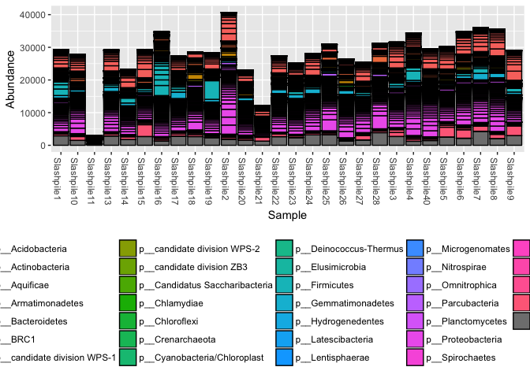

Filtering our dataset
---------------------

Lets generate a prevelance table (number of samples each taxa occurs in) for each taxa.

``` r
prevelancedf = apply(X = otu_table(s16sV1V3),
                 MARGIN = 1,
                 FUN = function(x){sum(x > 0)})
# Add taxonomy and total read counts to this data.frame
prevelancedf = data.frame(Prevalence = prevelancedf,
                      TotalAbundance = taxa_sums(s16sV1V3),
                      tax_table(s16sV1V3))
prevelancedf[1:10,]
```

    ##            Prevalence TotalAbundance     Kingdom           Phylum
    ## Taxa_00000          8             17  d__Archaea             <NA>
    ## Taxa_00001          1              1  d__Archaea p__Crenarchaeota
    ## Taxa_00002         28          63312 d__Bacteria             <NA>
    ## Taxa_00003         28           1864 d__Bacteria p__Acidobacteria
    ## Taxa_00004         28           9065 d__Bacteria p__Acidobacteria
    ## Taxa_00005         22            248 d__Bacteria p__Acidobacteria
    ## Taxa_00006          6             45 d__Bacteria p__Acidobacteria
    ## Taxa_00007         19             71 d__Bacteria p__Acidobacteria
    ## Taxa_00008         23            183 d__Bacteria p__Acidobacteria
    ## Taxa_00009         25            352 d__Bacteria p__Acidobacteria
    ##                            Class                Order            Family
    ## Taxa_00000                  <NA>                 <NA>              <NA>
    ## Taxa_00001       c__Thermoprotei o__Desulfurococcales f__Pyrodictiaceae
    ## Taxa_00002                  <NA>                 <NA>              <NA>
    ## Taxa_00003                  <NA>                 <NA>              <NA>
    ## Taxa_00004  c__Acidobacteria_Gp1                 <NA>              <NA>
    ## Taxa_00005 c__Acidobacteria_Gp10              o__Gp10           f__Gp10
    ## Taxa_00006 c__Acidobacteria_Gp11              o__Gp11           f__Gp11
    ## Taxa_00007 c__Acidobacteria_Gp12              o__Gp12           f__Gp12
    ## Taxa_00008 c__Acidobacteria_Gp13              o__Gp13           f__Gp13
    ## Taxa_00009 c__Acidobacteria_Gp15              o__Gp15           f__Gp15
    ##                   Genus
    ## Taxa_00000         <NA>
    ## Taxa_00001 g__Pyrolobus
    ## Taxa_00002         <NA>
    ## Taxa_00003         <NA>
    ## Taxa_00004         <NA>
    ## Taxa_00005      g__Gp10
    ## Taxa_00006      g__Gp11
    ## Taxa_00007      g__Gp12
    ## Taxa_00008      g__Gp13
    ## Taxa_00009      g__Gp15

### Whole phylum filtering

First lets remove of the feature with ambiguous phylum annotation.

``` r
s16sV1V3.1 <- subset_taxa(s16sV1V3, !is.na(Phylum) & !Phylum %in% c("", "uncharacterized"))
s16sV1V3.1
```

    ## phyloseq-class experiment-level object
    ## otu_table()   OTU Table:         [ 947 taxa and 28 samples ]
    ## sample_data() Sample Data:       [ 28 samples by 4 sample variables ]
    ## tax_table()   Taxonomy Table:    [ 947 taxa by 6 taxonomic ranks ]

Now lets investigate low prevelance/abundance phylum and subset them out.

``` r
plyr::ddply(prevelancedf, "Phylum", function(df1){
  data.frame(mean_prevalence=mean(df1$Prevalence),total_abundance=sum(df1$TotalAbundance,na.rm = T),stringsAsFactors = F)
  })
```

    ##                            Phylum mean_prevalence total_abundance
    ## 1                p__Acidobacteria       20.463415          143267
    ## 2               p__Actinobacteria       10.103448           51992
    ## 3                    p__Aquificae        1.333333               4
    ## 4              p__Armatimonadetes       23.857143            4363
    ## 5                p__Bacteroidetes       12.171053           35807
    ## 6                         p__BRC1       26.000000              95
    ## 7     p__candidate division WPS-1       28.000000            6988
    ## 8     p__candidate division WPS-2       27.000000            1083
    ## 9       p__candidate division ZB3        1.000000               1
    ## 10 p__Candidatus Saccharibacteria       28.000000            3335
    ## 11                  p__Chlamydiae        8.800000              81
    ## 12                 p__Chloroflexi       13.444444            6881
    ## 13               p__Crenarchaeota        1.000000               1
    ## 14   p__Cyanobacteria/Chloroplast        8.625000             613
    ## 15         p__Deinococcus-Thermus        3.000000               4
    ## 16               p__Elusimicrobia        9.333333              50
    ## 17                  p__Firmicutes        8.798246           59168
    ## 18            p__Gemmatimonadetes       28.000000           22581
    ## 19             p__Hydrogenedentes        9.000000              16
    ## 20             p__Latescibacteria       25.000000             398
    ## 21               p__Lentisphaerae        5.000000              27
    ## 22              p__Microgenomates       21.000000             192
    ## 23                 p__Nitrospirae       22.000000            1387
    ## 24                p__Omnitrophica        3.000000               3
    ## 25               p__Parcubacteria       28.000000            5848
    ## 26              p__Planctomycetes       21.363636           25294
    ## 27              p__Proteobacteria       12.359712          303888
    ## 28                p__Spirochaetes        5.125000              85
    ## 29                         p__SR1        7.000000              15
    ## 30                 p__Tenericutes        1.000000               2
    ## 31       p__Thermodesulfobacteria        1.000000               1
    ## 32             p__Verrucomicrobia       19.272727           54748
    ## 33                           <NA>       21.333333           64102

Using the table above, determine the phyla to filter

``` r
phyla2Filter = c("p__Aquificae", "p__candidate division ZB3", "p__Crenarchaeota",
                 "p__Deinococcus-Thermus","p__Omnitrophica","p__Tenericutes",
                 "p__Thermodesulfobacteria")
# Filter entries with unidentified Phylum.
s16sV1V3.1 = subset_taxa(s16sV1V3.1, !Phylum %in% phyla2Filter)
s16sV1V3.1
```

    ## phyloseq-class experiment-level object
    ## otu_table()   OTU Table:         [ 937 taxa and 28 samples ]
    ## sample_data() Sample Data:       [ 28 samples by 4 sample variables ]
    ## tax_table()   Taxonomy Table:    [ 937 taxa by 6 taxonomic ranks ]

### Individual Taxa Filtering

Subset to the remaining phyla by prevelance.

``` r
prevelancedf1 = subset(prevelancedf, Phylum %in% get_taxa_unique(s16sV1V3.1, taxonomic.rank = "Phylum"))
ggplot(prevelancedf1, aes(TotalAbundance, Prevalence / nsamples(s16sV1V3.1),color=Phylum)) +
  # Include a guess for parameter
  geom_hline(yintercept = 0.05, alpha = 0.5, linetype = 2) + geom_point(size = 2, alpha = 0.7) +
  scale_x_log10() +  xlab("Total Abundance") + ylab("Prevalence [Frac. Samples]") +
  facet_wrap(~Phylum) + theme(legend.position="none")
```


Sometimes you see a clear break, however we aren't seeing one here. In this case I'm moslty interested in those organisms consistantly present in the dataset, so I'm removing all taxa present in less than 50% of samples.

``` r
#  Define prevalence threshold as 10% of total samples
prevalenceThreshold = 0.50 * nsamples(s16sV1V3.1)
prevalenceThreshold
```

    ## [1] 14

``` r
# Execute prevalence filter, using `prune_taxa()` function
keepTaxa = rownames(prevelancedf1)[(prevelancedf1$Prevalence >= prevalenceThreshold)]
length(keepTaxa)
```

    ## [1] 381

``` r
s16sV1V3.2 = prune_taxa(keepTaxa, s16sV1V3.1)
s16sV1V3.2
```

    ## phyloseq-class experiment-level object
    ## otu_table()   OTU Table:         [ 381 taxa and 28 samples ]
    ## sample_data() Sample Data:       [ 28 samples by 4 sample variables ]
    ## tax_table()   Taxonomy Table:    [ 381 taxa by 6 taxonomic ranks ]

Agglomerate taxa at the Genus level (combine all with the same name) and remove all taxa without genus level assignment

``` r
length(get_taxa_unique(s16sV1V3.2, taxonomic.rank = "Genus"))
```

    ## [1] 269

``` r
s16sV1V3.3 = tax_glom(s16sV1V3.2, "Genus", NArm = TRUE)
s16sV1V3.3
```

    ## phyloseq-class experiment-level object
    ## otu_table()   OTU Table:         [ 268 taxa and 28 samples ]
    ## sample_data() Sample Data:       [ 28 samples by 4 sample variables ]
    ## tax_table()   Taxonomy Table:    [ 268 taxa by 6 taxonomic ranks ]

``` r
## out of curiosity how many "reads" does this leave us at???
sum(colSums(otu_table(s16sV1V3.3)))
```

    ## [1] 451105

Now lets filter out samples (outliers and low performing samples)
-----------------------------------------------------------------

Do some simple ordination looking for outlier samples, first we variance stabilize the data with a log transform, the perform PCoA using bray's distances

``` r
logt  = transform_sample_counts(s16sV1V3.3, function(x) log(1 + x) )
out.pcoa.logt <- ordinate(logt, method = "PCoA", distance = "bray")
evals <- out.pcoa.logt$values$Eigenvalues
plot_ordination(logt, out.pcoa.logt, type = "samples", 
                color = "Slash_pile_number", shape = "Depth_cm") + labs(col = "Slash pile number") +
  coord_fixed(sqrt(evals[2] / evals[1]))
```

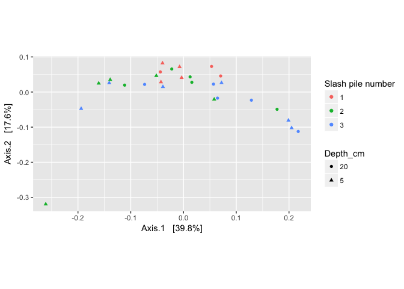

``` r
plot_ordination(logt, out.pcoa.logt, type = "species", color = "Phylum") 
```


``` r
  coord_fixed(sqrt(evals[2] / evals[1]))
```

    ## <ggproto object: Class CoordFixed, CoordCartesian, Coord>
    ##     aspect: function
    ##     distance: function
    ##     expand: TRUE
    ##     is_linear: function
    ##     labels: function
    ##     limits: list
    ##     range: function
    ##     ratio: 0.664509581087298
    ##     render_axis_h: function
    ##     render_axis_v: function
    ##     render_bg: function
    ##     render_fg: function
    ##     train: function
    ##     transform: function
    ##     super:  <ggproto object: Class CoordFixed, CoordCartesian, Coord>

You could also use the MDS method of ordination here, edit the code to do so. Can also edit the distance method used to jaccard, jsd, euclidean. Play with changing those parameters

``` r
#Can view the distance method options with 
?distanceMethodList

# can veiw the oridinate methods with
?ordinate
```

Show taxa proportions per sample

``` r
grid.arrange(nrow = 2,
qplot(as(otu_table(logt),"matrix")[, "Slashpile18"], geom = "histogram", bins=30) +
  xlab("Relative abundance"),

qplot(as(otu_table(logt),"matrix")[, "Slashpile10"], geom = "histogram", bins=30) +
  xlab("Relative abundance")
)
```

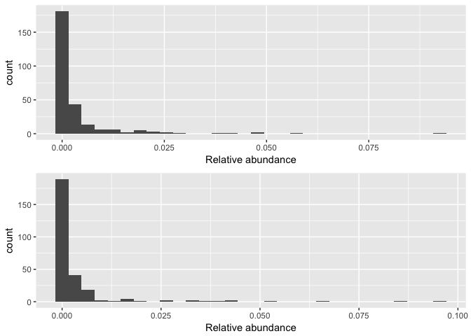

``` r
# if you needed to remove candidate outliers, can use the below to remove sample Slashpile18
#s16sV1V3.4 <- prune_samples(sample_names(s16sV1V3.4) != "Slashpile18", s16sV1V3.4)
```

Look for low perfroming samples

``` r
qplot(colSums(otu_table(s16sV1V3.3)),bins=30) +
  xlab("Logged counts-per-sample")
```

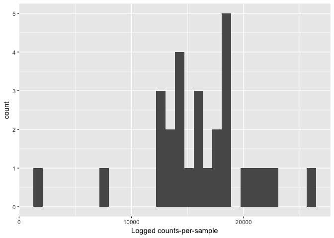

``` r
s16sV1V3.4 <- prune_samples(sample_sums(s16sV1V3.3)>=10000, s16sV1V3.3)
s16sV1V3.4
```

    ## phyloseq-class experiment-level object
    ## otu_table()   OTU Table:         [ 268 taxa and 26 samples ]
    ## sample_data() Sample Data:       [ 26 samples by 4 sample variables ]
    ## tax_table()   Taxonomy Table:    [ 268 taxa by 6 taxonomic ranks ]

Investigate transformations. We transform microbiome count data to account for differences in library size, variance, scale, etc.

``` r
## for Firmictures
plot_abundance = function(physeq, meta, title = "",
                 Facet = "Order", Color = "Order"){
  # Arbitrary subset, based on Phylum, for plotting
  p1f = subset_taxa(physeq, Phylum %in% c("p__Firmicutes"))
  mphyseq = psmelt(p1f)
  mphyseq <- subset(mphyseq, Abundance > 0)
  ggplot(data = mphyseq, mapping = aes_string(x = meta,y = "Abundance",
                                 color = Color, fill = Color)) +
    geom_violin(fill = NA) +
    geom_point(size = 1, alpha = 0.3,
                position = position_jitter(width = 0.3)) +
    facet_wrap(facets = Facet) + scale_y_log10()+
    theme(legend.position="none")
}

# transform counts into "abundances"
s16sV1V3.4ra = transform_sample_counts(s16sV1V3.4, function(x){x / sum(x)})

s16sV1V3.4hell <- s16sV1V3.4
otu_table(s16sV1V3.4hell) <-otu_table(decostand(otu_table(s16sV1V3.4hell), method = "hellinger"), taxa_are_rows=TRUE)

s16sV1V3.4log <- transform_sample_counts(s16sV1V3.4, function(x) log(1 + x))

plotOriginal = plot_abundance(s16sV1V3.4, "Slash_pile_number", title="original")
plotRelative = plot_abundance(s16sV1V3.4ra, "Slash_pile_number", title="relative")
plotHellinger = plot_abundance(s16sV1V3.4hell, "Slash_pile_number", title="Hellinger")
plotLog = plot_abundance(s16sV1V3.4log, "Slash_pile_number", title="Log")
# Combine each plot into one graphic.
grid.arrange(nrow = 4, plotOriginal, plotRelative, plotHellinger, plotLog)
```

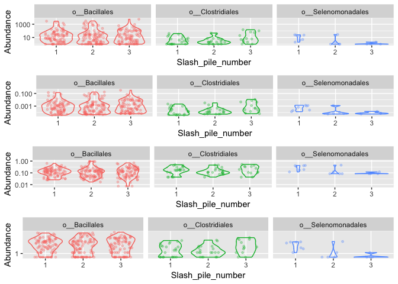

\[Normalization and microbial differential abundance strategies depend upon data characteristics\] (<https://microbiomejournal.biomedcentral.com/articles/10.1186/s40168-017-0237-y>)

Graphical Summaries
-------------------

``` r
plot_richness(s16sV1V3.4, measures=c("Observed","Chao1"))
```

    ## Warning: Removed 26 rows containing missing values (geom_errorbar).

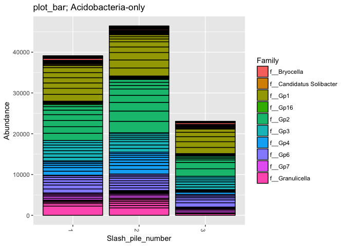

``` r
plot_richness(s16sV1V3.4, x = "Slash_pile_number", color="Depth_cm", measures=c("Chao1", "Shannon"))
```

    ## Warning: Removed 26 rows containing missing values (geom_errorbar).

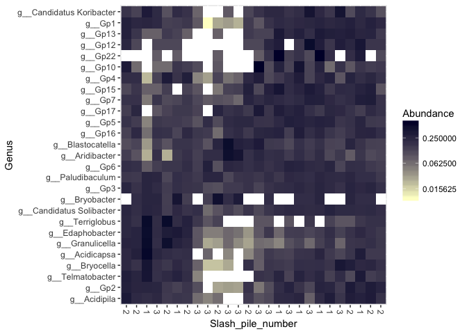

``` r
# Other Richness measures, "Observed", "Chao1", "ACE", "Shannon", "Simpson", "InvSimpson", "Fisher" try some of these others.

# Subset dataset by phylum
s16sV1V3.4hell_acidob = subset_taxa(s16sV1V3.4hell, Phylum=="p__Acidobacteria")
title = "plot_bar; Acidobacteria-only"
plot_bar(s16sV1V3.4hell_acidob, "Slash_pile_number", "Abundance", "Family", title=title)
```

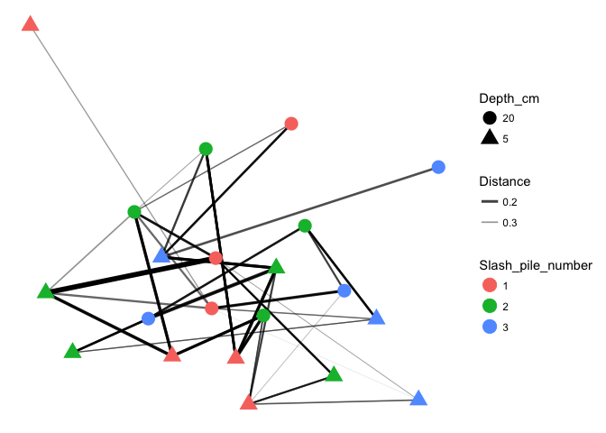

``` r
prop  = transform_sample_counts(s16sV1V3.4, function(x) x / sum(x) )
keepTaxa <- ((apply(otu_table(prop) >= 0.005,1,sum,na.rm=TRUE) > 2) | (apply(otu_table(prop) >= 0.05, 1, sum,na.rm=TRUE) > 0))
table(keepTaxa)
```

    ## keepTaxa
    ## FALSE  TRUE 
    ##   188    80

``` r
s16sV1V3.4hell_trim <- prune_taxa(keepTaxa,s16sV1V3.4hell)
plot_heatmap(s16sV1V3.4hell_trim, "PCoA", distance="bray", sample.label="Slash_pile_number", taxa.label="Genus", low="#FFFFCC", high="#000033", na.value="white")
```

    ## Warning: Transformation introduced infinite values in discrete y-axis

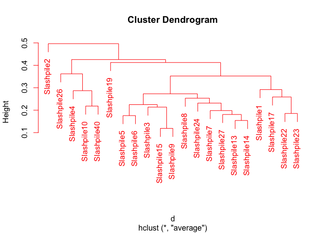

``` r
plot_net(s16sV1V3.4hell_trim, maxdist=0.4, color="Slash_pile_number", shape="Depth_cm")
```

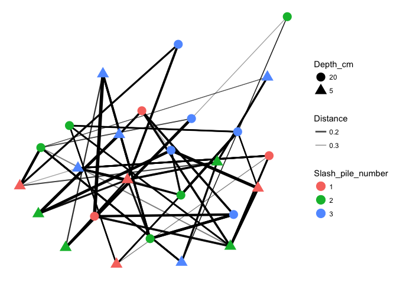

``` r
hell.tip.labels <- as(get_variable(s16sV1V3.4hell, "Slash_pile_number"), "character")
# This is the actual hierarchical clustering call, specifying average-linkage clustering
d <- distance(s16sV1V3.4hell, method="bray", type="samples")
hell.hclust     <- hclust(d, method="average")
plot(hell.hclust)
```

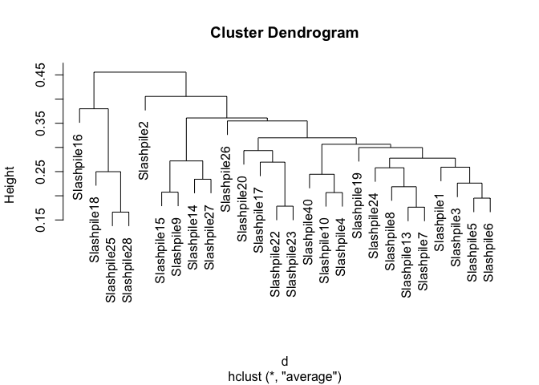

``` r
#Lets write out a plot
pdf("My_dendro.pdf", width=7, height=7, pointsize=8)
plot(hell.hclust)
dev.off()
```

    ## quartz_off_screen 
    ##                 2

``` r
png("My_dendro.png", width = 7, height = 7, res=300, units = "in")
plot(hell.hclust)
dev.off()
```

    ## quartz_off_screen 
    ##                 2

Ordination
----------

``` r
v4.hell.ord <- ordinate(s16sV1V3.4hell, "NMDS", "bray")
```

    ## Run 0 stress 0.09454798 
    ## Run 1 stress 0.1041802 
    ## Run 2 stress 0.1041538 
    ## Run 3 stress 0.09454804 
    ## ... Procrustes: rmse 1.977178e-05  max resid 4.431723e-05 
    ## ... Similar to previous best
    ## Run 4 stress 0.1041538 
    ## Run 5 stress 0.09454798 
    ## ... New best solution
    ## ... Procrustes: rmse 1.507298e-05  max resid 5.150159e-05 
    ## ... Similar to previous best
    ## Run 6 stress 0.1041808 
    ## Run 7 stress 0.09454799 
    ## ... Procrustes: rmse 1.344327e-05  max resid 3.25311e-05 
    ## ... Similar to previous best
    ## Run 8 stress 0.1149432 
    ## Run 9 stress 0.1472145 
    ## Run 10 stress 0.1041537 
    ## Run 11 stress 0.1041802 
    ## Run 12 stress 0.1516874 
    ## Run 13 stress 0.09454797 
    ## ... New best solution
    ## ... Procrustes: rmse 1.539529e-05  max resid 5.360946e-05 
    ## ... Similar to previous best
    ## Run 14 stress 0.1041539 
    ## Run 15 stress 0.09454797 
    ## ... New best solution
    ## ... Procrustes: rmse 1.448488e-06  max resid 2.788794e-06 
    ## ... Similar to previous best
    ## Run 16 stress 0.1502374 
    ## Run 17 stress 0.09454797 
    ## ... Procrustes: rmse 2.484649e-06  max resid 7.468013e-06 
    ## ... Similar to previous best
    ## Run 18 stress 0.09454797 
    ## ... Procrustes: rmse 4.146237e-06  max resid 1.355354e-05 
    ## ... Similar to previous best
    ## Run 19 stress 0.09454797 
    ## ... New best solution
    ## ... Procrustes: rmse 1.465445e-06  max resid 3.117937e-06 
    ## ... Similar to previous best
    ## Run 20 stress 0.09454797 
    ## ... Procrustes: rmse 2.664022e-06  max resid 8.22876e-06 
    ## ... Similar to previous best
    ## *** Solution reached

``` r
p1 = plot_ordination(s16sV1V3.4hell, v4.hell.ord, type="taxa", color="Phylum", title="taxa")
print(p1)
```

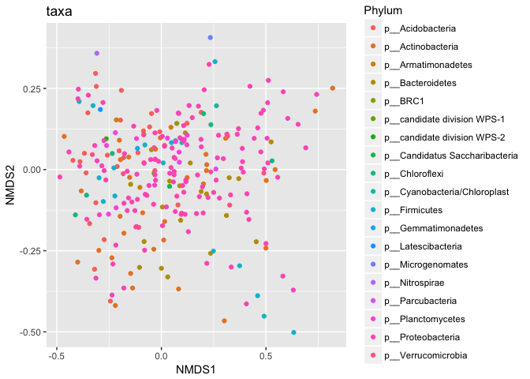

``` r
p1 + facet_wrap(~Phylum, 5)
```

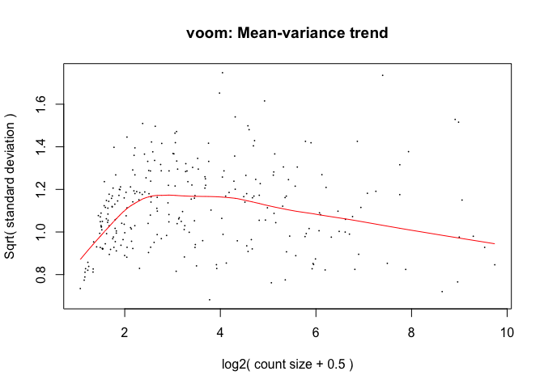

``` r
p2 = plot_ordination(s16sV1V3.4hell, v4.hell.ord, type="samples", color="Depth_cm", shape="Slash_pile_number") 
p2 + geom_polygon(aes(fill=Slash_pile_number)) + geom_point(size=5) + ggtitle("samples")
```

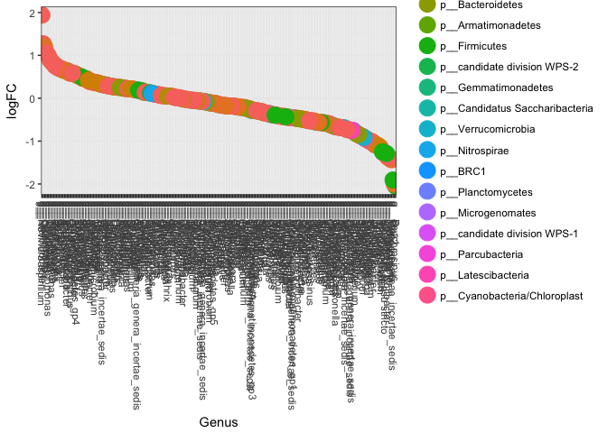

Now try doing oridination with other transformations, such as relative abundance, log. Also looks and see if you can find any trends in the variable Dist\_from\_edge.

Differential Abundances
-----------------------

For differential abundances we use RNAseq pipeline EdgeR and limma voom.

``` r
library("edgeR")
```

    ## Loading required package: limma

``` r
m = as(otu_table(s16sV1V3.4), "matrix")
# Add one to protect against overflow, log(0) issues.
m = m + 1
# Define gene annotations (`genes`) as tax_table
taxonomy = tax_table(s16sV1V3.4, errorIfNULL=FALSE)
if( !is.null(taxonomy) ){
  taxonomy = data.frame(as(taxonomy, "matrix"))
} 
# Now turn into a DGEList
d = DGEList(counts=m, genes=taxonomy, remove.zeros = TRUE)

# Calculate the normalization factors
z = calcNormFactors(d, method="RLE")
# Check for division by zero inside `calcNormFactors`
if( !all(is.finite(z$samples$norm.factors)) ){
  stop("Something wrong with edgeR::calcNormFactors on this data,
       non-finite $norm.factors, consider changing `method` argument")
}

plotMDS(z, col = as.numeric(factor(sample_data(s16sV1V3.4)$Slash_pile_number)), labels = sample_names(s16sV1V3.4))
```

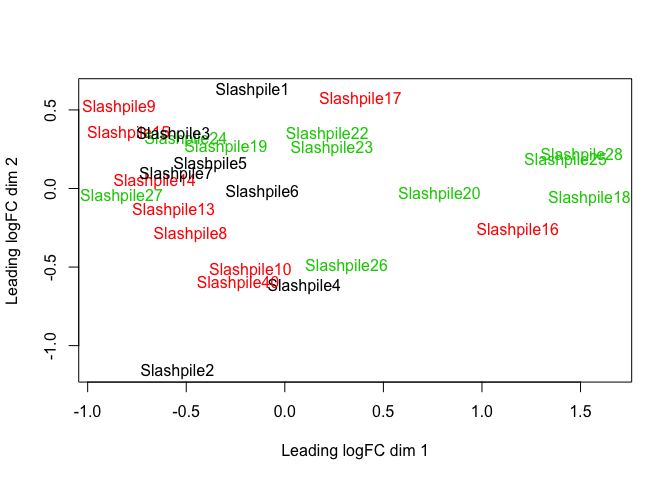

``` r
# Creat a model based on Slash_pile_number and depth
mm <- model.matrix(~ Slash_pile_number + Depth_cm, data=data.frame(as(sample_data(s16sV1V3.4),"matrix"))) # specify model with no intercept for easier contrasts
```

    ## Warning in class(X) <- NULL: Setting class(x) to NULL; result will no
    ## longer be an S4 object

``` r
mm
```

    ##             (Intercept) Slash_pile_number2 Slash_pile_number3 Depth_cm5
    ## Slashpile1            1                  0                  0         1
    ## Slashpile10           1                  1                  0         0
    ## Slashpile13           1                  1                  0         1
    ## Slashpile14           1                  1                  0         0
    ## Slashpile15           1                  1                  0         1
    ## Slashpile16           1                  1                  0         0
    ## Slashpile17           1                  1                  0         1
    ## Slashpile18           1                  0                  1         0
    ## Slashpile19           1                  0                  1         1
    ## Slashpile2            1                  0                  0         1
    ## Slashpile20           1                  0                  1         0
    ## Slashpile22           1                  0                  1         0
    ## Slashpile23           1                  0                  1         1
    ## Slashpile24           1                  0                  1         0
    ## Slashpile25           1                  0                  1         1
    ## Slashpile26           1                  0                  1         0
    ## Slashpile27           1                  0                  1         1
    ## Slashpile28           1                  0                  1         1
    ## Slashpile3            1                  0                  0         1
    ## Slashpile4            1                  0                  0         0
    ## Slashpile40           1                  1                  0         0
    ## Slashpile5            1                  0                  0         1
    ## Slashpile6            1                  0                  0         0
    ## Slashpile7            1                  0                  0         0
    ## Slashpile8            1                  1                  0         0
    ## Slashpile9            1                  1                  0         1
    ## attr(,"assign")
    ## [1] 0 1 1 2
    ## attr(,"contrasts")
    ## attr(,"contrasts")$Slash_pile_number
    ## [1] "contr.treatment"
    ## 
    ## attr(,"contrasts")$Depth_cm
    ## [1] "contr.treatment"

``` r
y <- voom(d, mm, plot = T)
```

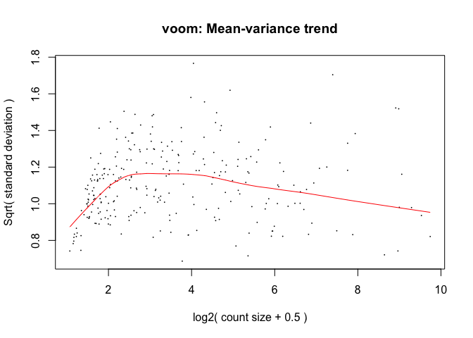

``` r
fit <- lmFit(y, mm)
head(coef(fit))
```

    ##            (Intercept) Slash_pile_number2 Slash_pile_number3   Depth_cm5
    ## Taxa_00005    9.319727        -0.90802338         -0.5995787 -0.97468059
    ## Taxa_00007    7.582090        -0.40477165         -0.1401075  0.35726433
    ## Taxa_00008    8.902649        -0.45194346         -1.0614156  0.14971024
    ## Taxa_00009    8.520510         0.05426432          0.1214146  1.21637400
    ## Taxa_00010   11.868568         0.10401232          0.5951760  0.38274218
    ## Taxa_00011    8.795769         0.29373084          0.4107084 -0.09173845

``` r
# Comparison between cultivars C and I5 at time 6
contr <- makeContrasts(Depth5v10 = "Depth_cm5",
                       levels = colnames(coef(fit)))
```

    ## Warning in makeContrasts(Depth5v10 = "Depth_cm5", levels =
    ## colnames(coef(fit))): Renaming (Intercept) to Intercept

``` r
tmp <- contrasts.fit(fit, contr)
```

    ## Warning in contrasts.fit(fit, contr): row names of contrasts don't match
    ## col names of coefficients

``` r
tmp <- eBayes(tmp)
tmp2 <- topTable(tmp, coef=1, sort.by = "P", n = Inf)
tmp2$Taxa <- rownames(tmp2)
tmp2 <- tmp2[,c("Taxa","logFC","AveExpr","P.Value","adj.P.Val")]
length(which(tmp2$adj.P.Val < 0.05)) # number of DE genes
```

    ## [1] 0

``` r
# 0
sigtab = cbind(as(tmp2, "data.frame"), as(tax_table(s16sV1V3.4)[rownames(tmp2), ], "matrix"))

theme_set(theme_bw())
scale_fill_discrete <- function(palname = "Set1", ...) {
    scale_fill_brewer(palette = palname, ...)
}
sigtabgen = subset(sigtab, !is.na(Genus))
# Phylum order
x = tapply(sigtabgen$logFC, sigtabgen$Phylum, function(x) max(x))
x = sort(x, TRUE)
sigtabgen$Phylum = factor(as.character(sigtabgen$Phylum), levels = names(x))
# Genus order
x = tapply(sigtabgen$logFC, sigtabgen$Genus, function(x) max(x))
x = sort(x, TRUE)
sigtabgen$Genus = factor(as.character(sigtabgen$Genus), levels = names(x))
ggplot(sigtabgen, aes(x = Genus, y = logFC, color = Phylum)) + geom_point(size=6) + 
  theme(axis.text.x = element_text(angle = -90, hjust = 0, vjust = 0.5))
```

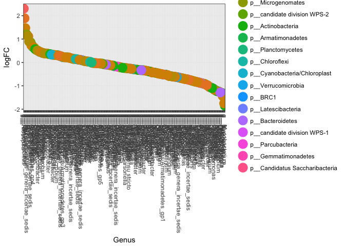
