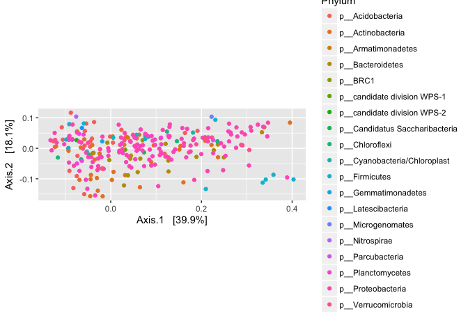

Using the Phyloseq package
==========================

installation from bioconductor
------------------------------

``` r
#source("http://bioconductor.org/biocLite.R")
#biocLite("phyloseq")
library(phyloseq)
library(ggplot2)
library(gridExtra)
```

Read in the dataset, biom file generated from dbcAmplicons pipeline
-------------------------------------------------------------------

``` r
slashpile_16sV1V3 <- "16sV1V3.biom"
s16sV1V3 = import_biom(BIOMfilename = slashpile_16sV1V3, parseFunction = parse_taxonomy_default)
colnames(tax_table(s16sV1V3)) <- c("Kingdom", "Phylum", "Class", "Order", "Family", "Genus")
rank_names(s16sV1V3)
```

    ## [1] "Kingdom" "Phylum"  "Class"   "Order"   "Family"  "Genus"

``` r
# sample_variables(GlobalPatterns)
sample_variables(s16sV1V3)
```

    ## [1] "Depth_cm"          "Dist_from_edge"    "Slash_pile_number"
    ## [4] "primers"

``` r
# [1] "Depth_cm"          "Dist_from_edge"    "Slash_pile_number" "primers" 
s16sV1V3
```

    ## phyloseq-class experiment-level object
    ## otu_table()   OTU Table:         [ 950 taxa and 28 samples ]
    ## sample_data() Sample Data:       [ 28 samples by 4 sample variables ]
    ## tax_table()   Taxonomy Table:    [ 950 taxa by 6 taxonomic ranks ]

Filtering
---------

Lets generate a prevelance table for each taxa

``` r
prevelancedf = apply(X = otu_table(s16sV1V3),
                 MARGIN = 1,
                 FUN = function(x){sum(x > 0)})
# Add taxonomy and total read counts to this data.frame
prevelancedf = data.frame(Prevalence = prevelancedf,
                      TotalAbundance = taxa_sums(s16sV1V3),
                      tax_table(s16sV1V3))
prevelancedf[1:10,]
```

    ##            Prevalence TotalAbundance     Kingdom           Phylum
    ## Taxa_00000          8             17  d__Archaea             <NA>
    ## Taxa_00001          1              1  d__Archaea p__Crenarchaeota
    ## Taxa_00002         28          63312 d__Bacteria             <NA>
    ## Taxa_00003         28           1864 d__Bacteria p__Acidobacteria
    ## Taxa_00004         28           9065 d__Bacteria p__Acidobacteria
    ## Taxa_00005         22            248 d__Bacteria p__Acidobacteria
    ## Taxa_00006          6             45 d__Bacteria p__Acidobacteria
    ## Taxa_00007         19             71 d__Bacteria p__Acidobacteria
    ## Taxa_00008         23            183 d__Bacteria p__Acidobacteria
    ## Taxa_00009         25            352 d__Bacteria p__Acidobacteria
    ##                            Class                Order            Family
    ## Taxa_00000                  <NA>                 <NA>              <NA>
    ## Taxa_00001       c__Thermoprotei o__Desulfurococcales f__Pyrodictiaceae
    ## Taxa_00002                  <NA>                 <NA>              <NA>
    ## Taxa_00003                  <NA>                 <NA>              <NA>
    ## Taxa_00004  c__Acidobacteria_Gp1                 <NA>              <NA>
    ## Taxa_00005 c__Acidobacteria_Gp10              o__Gp10           f__Gp10
    ## Taxa_00006 c__Acidobacteria_Gp11              o__Gp11           f__Gp11
    ## Taxa_00007 c__Acidobacteria_Gp12              o__Gp12           f__Gp12
    ## Taxa_00008 c__Acidobacteria_Gp13              o__Gp13           f__Gp13
    ## Taxa_00009 c__Acidobacteria_Gp15              o__Gp15           f__Gp15
    ##                   Genus
    ## Taxa_00000         <NA>
    ## Taxa_00001 g__Pyrolobus
    ## Taxa_00002         <NA>
    ## Taxa_00003         <NA>
    ## Taxa_00004         <NA>
    ## Taxa_00005      g__Gp10
    ## Taxa_00006      g__Gp11
    ## Taxa_00007      g__Gp12
    ## Taxa_00008      g__Gp13
    ## Taxa_00009      g__Gp15

The following ensures that features with ambiguous phylum annotation are also removed.

``` r
s16sV1V3.1 <- subset_taxa(s16sV1V3, !is.na(Phylum) & !Phylum %in% c("", "uncharacterized"))
s16sV1V3.1
```

    ## phyloseq-class experiment-level object
    ## otu_table()   OTU Table:         [ 947 taxa and 28 samples ]
    ## sample_data() Sample Data:       [ 28 samples by 4 sample variables ]
    ## tax_table()   Taxonomy Table:    [ 947 taxa by 6 taxonomic ranks ]

### Now subset low occurance taxa

``` r
plyr::ddply(prevelancedf, "Phylum", function(df1){
  data.frame(mean_prevalence=mean(df1$Prevalence),mean_abundance=mean(df1$TotalAbundance,na.rm = T),stringsAsFactors = F)
  })
```

    ##                            Phylum mean_prevalence mean_abundance
    ## 1                p__Acidobacteria       20.463415    3494.317073
    ## 2               p__Actinobacteria       10.103448     298.804598
    ## 3                    p__Aquificae        1.333333       1.333333
    ## 4              p__Armatimonadetes       23.857143     623.285714
    ## 5                p__Bacteroidetes       12.171053     471.144737
    ## 6                         p__BRC1       26.000000      95.000000
    ## 7     p__candidate division WPS-1       28.000000    6988.000000
    ## 8     p__candidate division WPS-2       27.000000    1083.000000
    ## 9       p__candidate division ZB3        1.000000       1.000000
    ## 10 p__Candidatus Saccharibacteria       28.000000    3335.000000
    ## 11                  p__Chlamydiae        8.800000      16.200000
    ## 12                 p__Chloroflexi       13.444444     254.851852
    ## 13               p__Crenarchaeota        1.000000       1.000000
    ## 14   p__Cyanobacteria/Chloroplast        8.625000      76.625000
    ## 15         p__Deinococcus-Thermus        3.000000       4.000000
    ## 16               p__Elusimicrobia        9.333333      16.666667
    ## 17                  p__Firmicutes        8.798246     519.017544
    ## 18            p__Gemmatimonadetes       28.000000   22581.000000
    ## 19             p__Hydrogenedentes        9.000000      16.000000
    ## 20             p__Latescibacteria       25.000000     398.000000
    ## 21               p__Lentisphaerae        5.000000      13.500000
    ## 22              p__Microgenomates       21.000000     192.000000
    ## 23                 p__Nitrospirae       22.000000    1387.000000
    ## 24                p__Omnitrophica        3.000000       3.000000
    ## 25               p__Parcubacteria       28.000000    5848.000000
    ## 26              p__Planctomycetes       21.363636    1149.727273
    ## 27              p__Proteobacteria       12.359712     728.748201
    ## 28                p__Spirochaetes        5.125000      10.625000
    ## 29                         p__SR1        7.000000      15.000000
    ## 30                 p__Tenericutes        1.000000       1.000000
    ## 31       p__Thermodesulfobacteria        1.000000       1.000000
    ## 32             p__Verrucomicrobia       19.272727    2488.545455
    ## 33                           <NA>       21.333333   21367.333333

### Define phyla to filter

``` r
phyla2Filter = c("p__Aquificae", "p__candidate division ZB3",
  "p__Crenarchaeota","p__Deinococcus-Thermus","p__Omnitrophica","p__Tenericutes","p__Thermodesulfobacteria")
# Filter entries with unidentified Phylum.
s16sV1V3.2 = subset_taxa(s16sV1V3.1, !Phylum %in% phyla2Filter)
s16sV1V3.2
```

    ## phyloseq-class experiment-level object
    ## otu_table()   OTU Table:         [ 937 taxa and 28 samples ]
    ## sample_data() Sample Data:       [ 28 samples by 4 sample variables ]
    ## tax_table()   Taxonomy Table:    [ 937 taxa by 6 taxonomic ranks ]

### Subset to the remaining phyla

``` r
prevelancedf1 = subset(prevelancedf, Phylum %in% get_taxa_unique(s16sV1V3.2, taxonomic.rank = "Phylum"))
ggplot(prevelancedf1, aes(TotalAbundance, Prevalence / nsamples(s16sV1V3.2),color=Phylum)) +
  # Include a guess for parameter
  geom_hline(yintercept = 0.05, alpha = 0.5, linetype = 2) + geom_point(size = 2, alpha = 0.7) +
  scale_x_log10() +  xlab("Total Abundance") + ylab("Prevalence [Frac. Samples]") +
  facet_wrap(~Phylum) + theme(legend.position="none")
```


``` r
#  Define prevalence threshold as 10% of total samples
prevalenceThreshold = 0.10 * nsamples(s16sV1V3.2)
prevalenceThreshold
```

    ## [1] 2.8

``` r
# Execute prevalence filter, using `prune_taxa()` function
keepTaxa = rownames(prevelancedf1)[(prevelancedf1$Prevalence >= prevalenceThreshold)]
s16sV1V3.3 = prune_taxa(keepTaxa, s16sV1V3.2)
s16sV1V3.3
```

    ## phyloseq-class experiment-level object
    ## otu_table()   OTU Table:         [ 710 taxa and 28 samples ]
    ## sample_data() Sample Data:       [ 28 samples by 4 sample variables ]
    ## tax_table()   Taxonomy Table:    [ 710 taxa by 6 taxonomic ranks ]

### Agglomerate taxa and remove all taxa with not at the genus level

``` r
prop  = transform_sample_counts(s16sV1V3.3, function(x) x / sum(x) )
keepTaxa <- ((apply(otu_table(prop) >= 0.005,1,sum,na.rm=TRUE) > 2) | (apply(otu_table(prop) >= 0.05, 1, sum,na.rm=TRUE) > 0))
table(keepTaxa)
```

    ## keepTaxa
    ## FALSE  TRUE 
    ##   627    83

``` r
s16sV1V3.4 <- prune_taxa(keepTaxa,s16sV1V3.3)

length(get_taxa_unique(s16sV1V3.4, taxonomic.rank = "Genus"))
```

    ## [1] 50

``` r
s16sV1V3.4 = tax_glom(s16sV1V3.4, "Genus", NArm = TRUE)
s16sV1V3.4
```

    ## phyloseq-class experiment-level object
    ## otu_table()   OTU Table:         [ 49 taxa and 28 samples ]
    ## sample_data() Sample Data:       [ 28 samples by 4 sample variables ]
    ## tax_table()   Taxonomy Table:    [ 49 taxa by 6 taxonomic ranks ]

``` r
plot_abundance = function(physeq,title = "",
                 Facet = "Order", Color = "Phylum"){
  # Arbitrary subset, based on Phylum, for plotting
  p1f = subset_taxa(physeq, Phylum %in% c("p__Firmicutes"))
  mphyseq = psmelt(p1f)
  mphyseq <- subset(mphyseq, Abundance > 0)
  ggplot(data = mphyseq, mapping = aes_string(x = "Slash_pile_number",y = "Abundance",
                                 color = Color, fill = Color)) +
    geom_violin(fill = NA) +
    geom_point(size = 1, alpha = 0.3,
                position = position_jitter(width = 0.3)) +
    facet_wrap(facets = Facet) + scale_y_log10()+
    theme(legend.position="none")
}

s16sV1V3.4ra = transform_sample_counts(s16sV1V3.4, function(x){x / sum(x)})

plotBefore = plot_abundance(s16sV1V3.4,"before")
plotAfter = plot_abundance(s16sV1V3.4ra,"after")
# Combine each plot into one graphic.
grid.arrange(nrow = 2, plotBefore, plotAfter)
```


``` r
qplot(log10(colSums(otu_table(s16sV1V3.4))),bins=30) +
  xlab("Logged counts-per-sample")
```



``` r
s16sV1V3.4 <- prune_samples(sample_sums(s16sV1V3.4)>=10000, s16sV1V3.4)
```

``` r
s16sV1V3.4log <- transform_sample_counts(s16sV1V3.4, function(x) log(1 + x))
out.pcoa.log <- ordinate(s16sV1V3.4log, method = "PCoA", distance = "bray")
evals <- out.pcoa.log$values$Eigenvalues
plot_ordination(s16sV1V3.4, out.pcoa.log, type = "samples", 
                color = "Slash_pile_number", shape = "Depth_cm") + labs(col = "Slash pile number") +
  coord_fixed(sqrt(evals[2] / evals[1]))
```


``` r
plot_ordination(s16sV1V3.4log, out.pcoa.log, type = "species", color = "Phylum") +
  coord_fixed(sqrt(evals[2] / evals[1]))
```


``` r
prop <- t(apply(otu_table(s16sV1V3.4log), 1, function(x) x / sum(x)))

grid.arrange(nrow = 2,
qplot(prop[, "Slashpile18"], geom = "histogram", bins=30) +
  xlab("Relative abundance"),

qplot(prop[, "Slashpile10"], geom = "histogram", bins=30) +
  xlab("Relative abundance")
)
```


``` r
s16sV1V3.4 <- prune_samples(sample_names(s16sV1V3.4) != "Slashpile18", s16sV1V3.4)
```

Graphical Summary
-----------------

``` r
s16sV1V3.4_acidob = subset_taxa(s16sV1V3.4, Phylum=="p__Acidobacteria")
title = "plot_bar; Acidobacteria-only"
plot_bar(s16sV1V3.4_acidob, "Slash_pile_number", "Abundance", "Family", title=title)
```


``` r
plot_heatmap(s16sV1V3.4, "PCoA", distance="bray", sample.label="Slash_pile_number", taxa.label="Genus", low="#FFFFCC", high="#000033", na.value="white")
```

    ## Warning: Transformation introduced infinite values in discrete y-axis


``` r
plot_net(s16sV1V3.4, maxdist=0.4, color="Slash_pile_number", shape="Depth_cm")
```


``` r
colorScale    <- rainbow(length(levels(as.factor(get_variable(s16sV1V3.4, "Slash_pile_number")))))
cols          <- colorScale[as.factor(get_variable(s16sV1V3.4, "Slash_pile_number"))] 
GP.tip.labels <- as(get_variable(s16sV1V3.4, "Slash_pile_number"), "character")
# This is the actual hierarchical clustering call, specifying average-link clustering
d <- distance(s16sV1V3.4, method="bray", type="samples")
GP.hclust     <- hclust(d, method="average")
plot(GP.hclust, col=cols)
```


Differntial Abundances
----------------------

``` r
library("edgeR")
```

    ## Loading required package: limma

``` r
m = as(otu_table(s16sV1V3.4), "matrix")
# Add one to protect against overflow, log(0) issues.
m = m + 1
# Define gene annotations (`genes`) as tax_table
taxonomy = tax_table(s16sV1V3.4, errorIfNULL=FALSE)
if( !is.null(taxonomy) ){
  taxonomy = data.frame(as(taxonomy, "matrix"))
} 
# Now turn into a DGEList
d = DGEList(counts=m, genes=taxonomy, remove.zeros = TRUE)

# Calculate the normalization factors
z = calcNormFactors(d, method="TMM")
# Check for division by zero inside `calcNormFactors`
if( !all(is.finite(z$samples$norm.factors)) ){
  stop("Something wrong with edgeR::calcNormFactors on this data,
       non-finite $norm.factors, consider changing `method` argument")
}
plotMDS(z, col = as.numeric(factor(sample_data(s16sV1V3.4)$Slash_pile_number)), labels = sample_names(s16sV1V3.4))
```


``` r
mm <- model.matrix(~ 0 + Slash_pile_number, data=data.frame(as(sample_data(s16sV1V3.4),"matrix"))) # specify model with no intercept for easier contrasts
```

    ## Warning in class(X) <- NULL: Setting class(x) to NULL; result will no
    ## longer be an S4 object

``` r
mm
```

    ##             Slash_pile_number1 Slash_pile_number2 Slash_pile_number3
    ## Slashpile1                   1                  0                  0
    ## Slashpile10                  0                  1                  0
    ## Slashpile13                  0                  1                  0
    ## Slashpile14                  0                  1                  0
    ## Slashpile15                  0                  1                  0
    ## Slashpile17                  0                  1                  0
    ## Slashpile19                  0                  0                  1
    ## Slashpile2                   1                  0                  0
    ## Slashpile22                  0                  0                  1
    ## Slashpile23                  0                  0                  1
    ## Slashpile24                  0                  0                  1
    ## Slashpile26                  0                  0                  1
    ## Slashpile27                  0                  0                  1
    ## Slashpile3                   1                  0                  0
    ## Slashpile4                   1                  0                  0
    ## Slashpile40                  0                  1                  0
    ## Slashpile5                   1                  0                  0
    ## Slashpile6                   1                  0                  0
    ## Slashpile7                   1                  0                  0
    ## Slashpile8                   0                  1                  0
    ## Slashpile9                   0                  1                  0
    ## attr(,"assign")
    ## [1] 1 1 1
    ## attr(,"contrasts")
    ## attr(,"contrasts")$Slash_pile_number
    ## [1] "contr.treatment"

``` r
y <- voom(d, mm, plot = T)
```


``` r
fit <- lmFit(y, mm)
head(coef(fit))
```

    ##            Slash_pile_number1 Slash_pile_number2 Slash_pile_number3
    ## Taxa_00010           12.21104           12.73491           12.72643
    ## Taxa_00017           13.05873           13.08971           12.88461
    ## Taxa_00020           16.17751           16.23086           16.13421
    ## Taxa_00021           13.88179           14.28429           12.57436
    ## Taxa_00027           16.14141           16.61005           15.67566
    ## Taxa_00030           13.47133           13.18642           13.63932

``` r
# Comparison between cultivars C and I5 at time 6
contr <- makeContrasts(Slash_pile_number2 - Slash_pile_number1,
                       Slash_pile_number3 - Slash_pile_number1,
                       Slash_pile_number3 - Slash_pile_number2,
                       levels = colnames(coef(fit)))
tmp <- contrasts.fit(fit, contr)
tmp <- eBayes(tmp)
tmp2 <- topTable(tmp, coef=1, sort.by = "P", n = Inf)
tmp2$Taxa <- rownames(tmp2)
tmp2 <- tmp2[,c("Taxa","logFC","AveExpr","P.Value","adj.P.Val")]
length(which(tmp2$adj.P.Val < 0.05)) # number of DE genes
```

    ## [1] 0

``` r
# 0
sigtab = cbind(as(tmp2, "data.frame"), as(tax_table(s16sV1V3.4)[rownames(tmp2), ], "matrix"))

theme_set(theme_bw())
scale_fill_discrete <- function(palname = "Set1", ...) {
    scale_fill_brewer(palette = palname, ...)
}
sigtabgen = subset(sigtab, !is.na(Genus))
# Phylum order
x = tapply(sigtabgen$logFC, sigtabgen$Phylum, function(x) max(x))
x = sort(x, TRUE)
sigtabgen$Phylum = factor(as.character(sigtabgen$Phylum), levels = names(x))
# Genus order
x = tapply(sigtabgen$logFC, sigtabgen$Genus, function(x) max(x))
x = sort(x, TRUE)
sigtabgen$Genus = factor(as.character(sigtabgen$Genus), levels = names(x))
ggplot(sigtabgen, aes(x = Genus, y = logFC, color = Phylum)) + geom_point(size=6) + 
  theme(axis.text.x = element_text(angle = -90, hjust = 0, vjust = 0.5))
```


